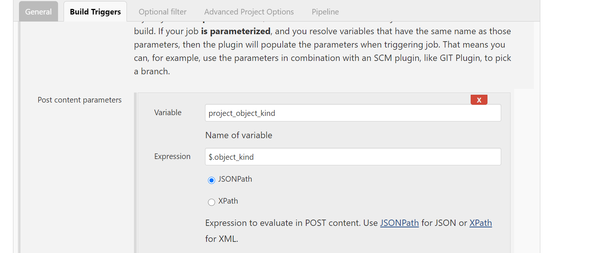
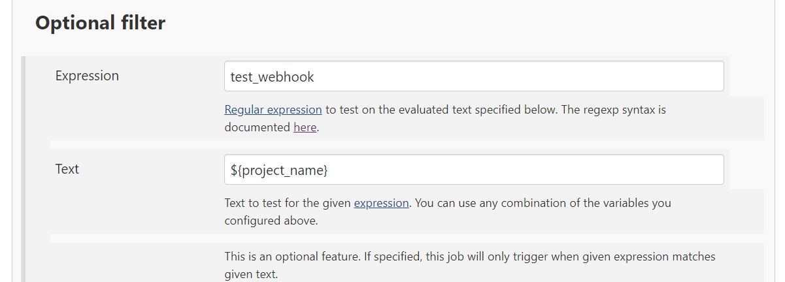

# 自动化
通过gitlab,jenkins进行自动化构建和部署.
基本思路是代码上传到gitlab后通过webhook自动触发jenkins完成构建.
## 准备工作
1. Jenkins通过使用Jenkins Generic Webhook插件.然后新建一个pipeline, 勾选使用Generic Webhook Trigger
用于解析不同类型的webhook event.
2. 配置gitlab webhook url 及token.
## 配置
1. Jenkins新建一个pipeline, 勾选使用Generic Webhook Trigger, 设置token.
2. Gitlab配置webhook url及token, url配置如下(替换自己的jenkins ip地址):
```
http://JENKINS_URL/generic-webhook-trigger/invoke
```
3. 通过git触发对应的event(提交,打标签等)即可测试构建

## 进阶使用
1. Generic Webhook解析参数,该插件通过jsonpath解析webhook http请求中的request body,而后放入设置的环境变量.

2. 为不同项目触发不同的pipeline,简单的做法可以通过不同的token指定,也可以通过Optional filter选项测试对应的参数,符合条件触发.


### 参考:
* [Gitlab Webhook](https://docs.gitlab.com/ce/user/project/integrations/webhooks.html)
* [Jenkins Generic webhook插件](https://github.com/jenkinsci/generic-webhook-trigger-plugin)
* [jsonpath](https://jsonpath.curiousconcept.com/#)
* [更多Jenkins教程](https://www.jenkins.io/zh/doc/pipeline/tour/getting-started/)

### 其它
1. Jenkins 使用环境变量,${name}
2. Jenkins中的管道(流水线)也就是pipeline.
3. Jenkins 中的pipeline scripts中是使用的groovy语言,一般以node标签开始. 使用自定义脚本在需要写一些自己的逻辑的时候很实用.
```
node{
    echo "hello"
    sh "printenv"
}
```
4. Jenkins pipeline scripts除了使用groovy还可以使用pipeline语法.